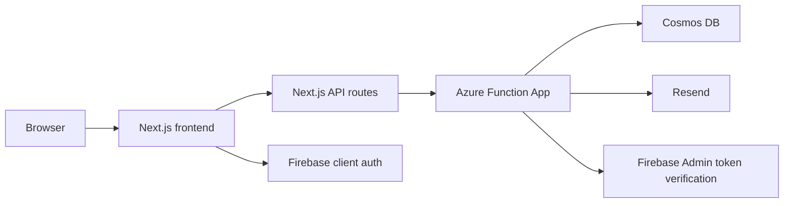
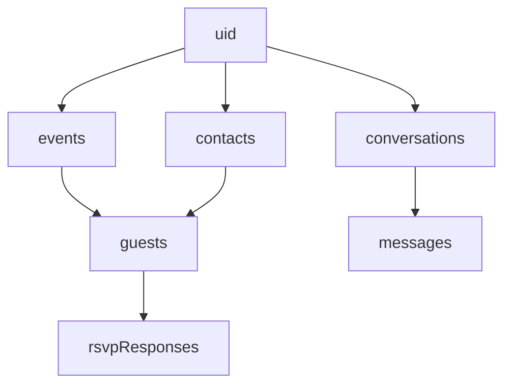

# Architecture

## High-level architecture

For step-by-step runtime behavior, see:

- [Runtime flows](https://github.com/ailekha375-cpu/ChatbotAIL/blob/main/docs/FLOWS.md)

## Frontend

Location:

- [invite-rsvp-app](https://github.com/ailekha375-cpu/ChatbotAIL/tree/main/invite-rsvp-app)

Responsibilities:

- rendering the app
- user auth state via Firebase client SDK
- chat UI
- event pages
- guest book UI
- RSVP pages
- frontend proxy routes under `src/app/api/*`

## Backend

Location:

- [lekha_function_app/function_app.py](https://github.com/ailekha375-cpu/ChatbotAIL/blob/main/lekha_function_app/function_app.py)

Responsibilities:

- verify Firebase ID tokens
- read and write Cosmos data
- issue RSVP tokens
- send emails
- return event, guest, and RSVP data

## Data model

### Events

- main event record
- event metadata
- send status summary

### Contacts

- reusable account-level guest book

### Guests

- event-level recipient assignment
- event-specific RSVP token
- event-specific send status

### RSVP responses

- event response data tied to a guest and token

## Main containers

Compact relationship summary:

- `events`
  - event metadata
  - campaign kit fields
- `contacts`
  - reusable account-level guest book
- `guests`
  - event-level recipient assignments
  - may reference `contactId`
  - holds RSVP token and send state
- `rsvpResponses`
  - guest response records tied to an event guest
- `conversations`
  - backend chat session metadata
- `messages`
  - backend chat history per conversation

- `events`
- `contacts`
- `guests`
- `rsvpResponses`
- `conversations`
- `messages`

## Auth flow

1. User signs in on frontend.
2. Frontend gets Firebase ID token.
3. Frontend sends token to Next.js API route.
4. Next.js route forwards request to Azure.
5. Azure verifies token with Firebase Admin.
6. Azure uses `uid` for user-owned data.

## Chat flow

1. User sends prompt in `/chat`.
2. Frontend calls `/api/chat`.
3. Proxy route forwards to Azure Function.
4. Azure returns text or image response.
5. Frontend offers actions like save to event or send invites.

## Send flow

1. User selects an event.
2. User saves invite image and email draft to the event.
3. User opens send modal and selects contacts.
4. Frontend calls event guest assignment route.
5. Backend creates or updates event guests and RSVP tokens.
6. Frontend calls send route.
7. Backend sends emails through provider.

## Contact and guest relationship

- `contacts` are reusable per account
- `guests` are event-specific recipient assignments
- a guest can point back to a `contactId`
- RSVP token and invite status stay on the guest, not on the contact

## RSVP flow

1. Guest clicks personal RSVP link.
2. Frontend proxy calls Azure token route.
3. Azure loads guest + event from token.
4. Guest submits response.
5. Azure stores RSVP response.
6. Host sees results in the responses dashboard.
