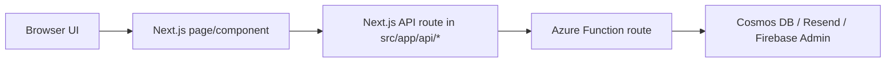
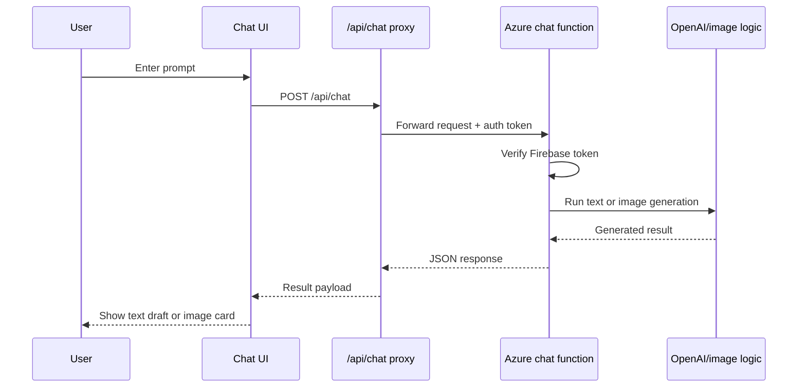
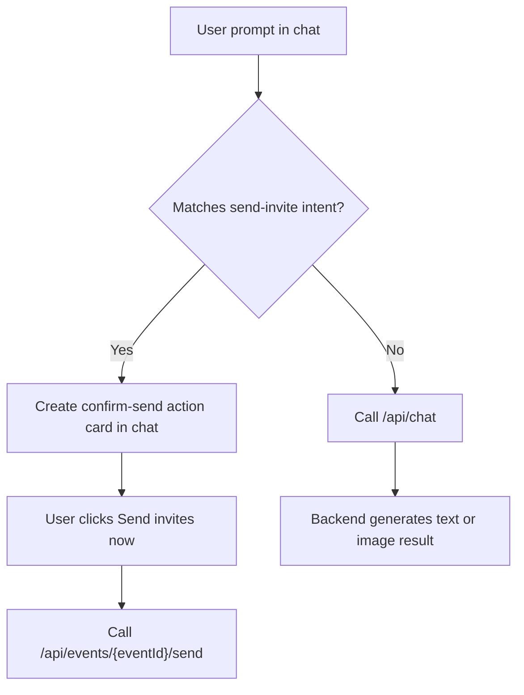
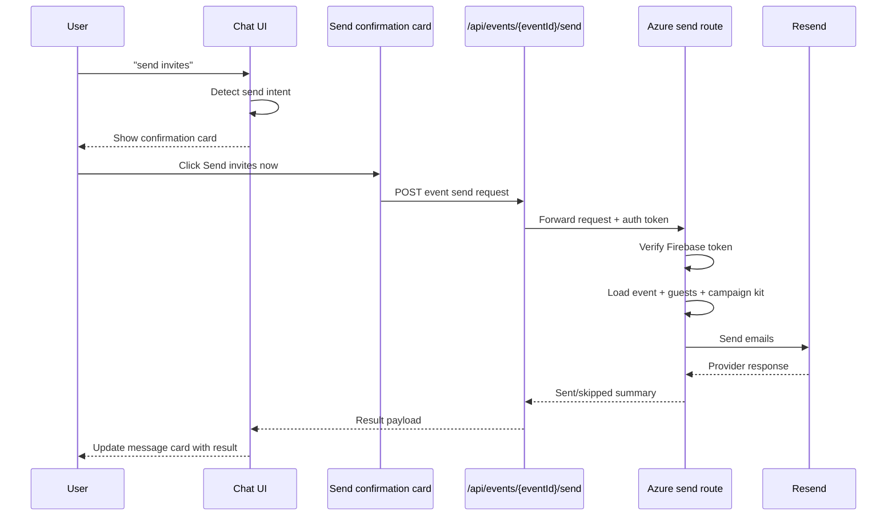
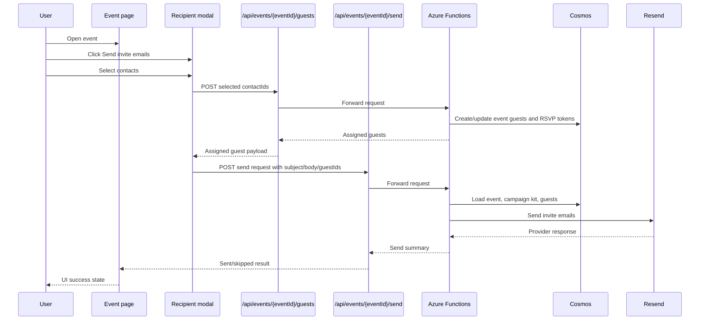
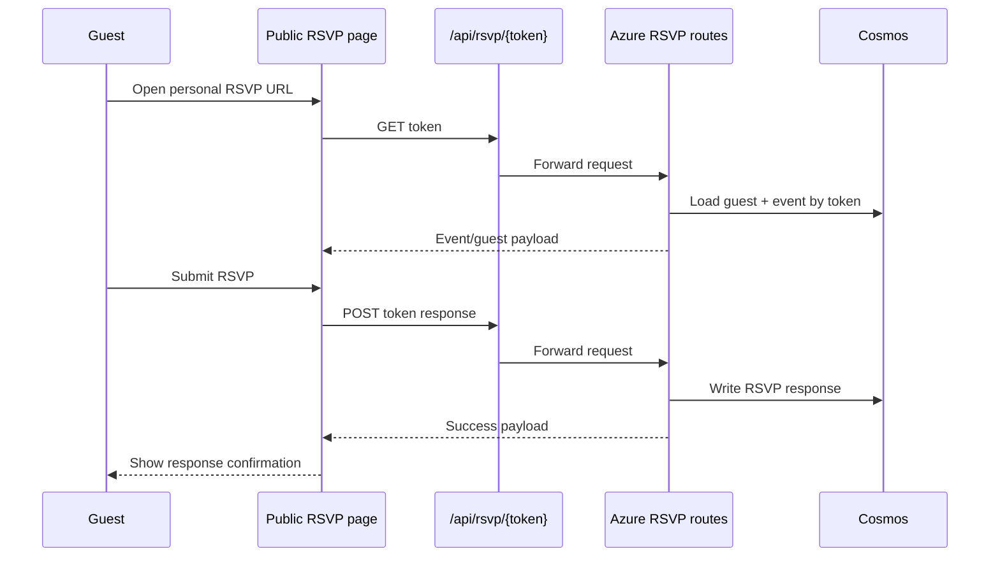
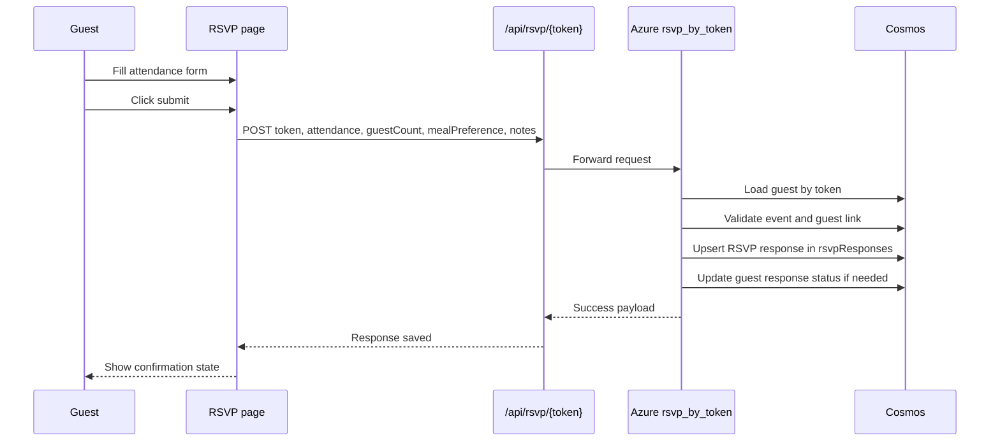
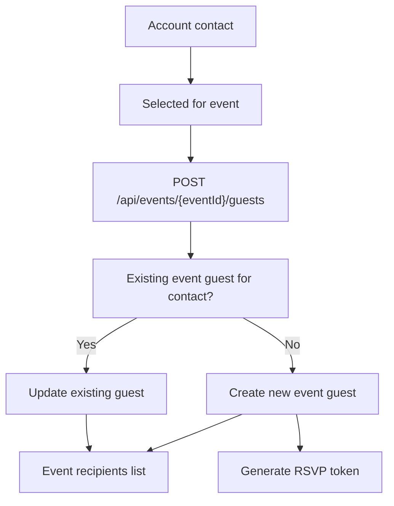
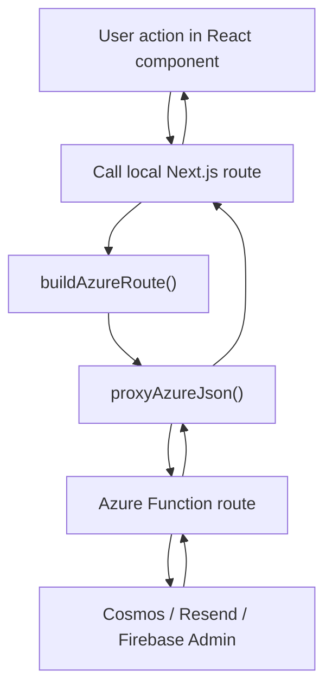

# Runtime flows

This file documents what actually happens at runtime for the main user actions.

## 1. Request routing model

The browser does not call Azure Functions directly.

Route pattern:

1. Browser action happens in a React component.
2. Component calls a local Next.js API route.
3. Next.js API route builds an Azure URL from `AZURE_FUNCTION_URL`.
4. Proxy forwards auth header and request body.
5. Azure Function verifies token and handles business logic.

## 2. Chat prompt flow

This is the standard text/image prompt path.

## 3. Prompt intent classification inside chat

Not every prompt is sent to Azure immediately. Some are handled as UI actions first.

Current logic in chat:

- if prompt looks like `send invites` / `send emails`
  - frontend treats it as a send intent
  - it creates a confirmation message card in the conversation
  - nothing is sent until the user confirms
- otherwise
  - prompt goes through the normal `/api/chat` backend flow

Current intent split:

### Frontend functions involved

- `ChatbotModal.handleSend()`
  - main entry point when the user submits a prompt
- `isSendInvitePrompt(text)`
  - lightweight send-intent classifier
- `runSendInvitesFromChat(messageId, eventId)`
  - executes the confirmed send action

### Current classification rule

The chat currently treats a message as send intent when:

- it contains `send`
- and also contains one of:
  - `invite`
  - `invites`
  - `email`
  - `emails`
- or it matches one of:
  - `send to all`
  - `send to everyone`
  - `send to pending`

Everything else stays in the normal chat path and goes to `/api/chat`.

## 4. Chat-triggered invite send flow

This is the agent-like send path currently implemented.

### What functions are called in this flow

1. `ChatbotModal.handleSend()`
2. `isSendInvitePrompt(text)`
3. if matched, create a local confirmation card
4. user clicks the confirmation action
5. `runSendInvitesFromChat(messageId, eventId)`
6. `POST /api/events/{eventId}/send`
7. frontend proxy helper in `src/app/api/_azureProxy.ts`
8. Azure route `events/{eventId}/send`

## 5. Event send flow from the event page

This is the standard send flow from the event workspace.

### What functions are called in this flow

Main frontend flow:

1. event page loads
2. user clicks `Send invite emails`
3. `RecipientPickerModal` opens
4. selected contacts are submitted
5. event page calls `POST /api/events/{eventId}/guests`
6. event page then calls `POST /api/events/{eventId}/send`

Main backend flow:

1. Azure route `events/{eventId}/guests`
2. Azure route `events/{eventId}/send`

The important difference from chat send is:

- event-page send starts from contacts and creates event guests first
- chat send uses already assigned event guests

## 6. What happens when `Send invite emails` is clicked

Detailed backend behavior:

1. Frontend checks basic eligibility:
   - event has saved invite image
   - event has email draft content
2. User opens recipient picker.
3. Frontend calls `POST /api/events/{eventId}/guests` with selected `contactIds`.
4. Backend:
   - verifies auth
   - loads selected contacts for the account
   - reuses existing event guests when `contactId` is already assigned
   - creates new event guests otherwise
   - generates RSVP token for new event guests
5. Frontend calls `POST /api/events/{eventId}/send`.
6. Backend:
   - verifies auth
   - loads event
   - loads event guests
   - loads campaign kit from event document
   - builds public RSVP link using `APP_BASE_URL`
   - sends emails through Resend
   - updates send metadata on event/guest records
7. Frontend shows sent/skipped summary.

## 7. RSVP flow

## 8. RSVP submission sequence

This is the write path after the guest opens the RSVP page and submits a response.

## 9. Contact and guest assignment flow

This matters because the product uses both account-level contacts and event-level guests.

## 10. Router and proxy logic in more detail

The app uses a local proxy layer between the browser and Azure.

### Frontend helper logic

Important files:

- `invite-rsvp-app/src/app/api/_azureProxy.ts`
- `invite-rsvp-app/src/app/components/ChatbotModal.tsx`
- `invite-rsvp-app/src/app/events/[eventId]/page.tsx`

Important frontend helpers:

- `buildAzureRoute()`
  - derives the Azure backend origin from `AZURE_FUNCTION_URL`
- `proxyAzureJson()`
  - forwards method, headers, body, auth token, timeout handling

### Why this matters

- browser code does not need to know every Azure route directly
- auth forwarding is centralized
- timeout and backend-unreachable handling is centralized
- deployment only needs one backend host env var

## 11. Intent to route mapping

This is the shortest practical map from user intent to actual route execution.

| User intent | Frontend function or page | Next.js route | Azure route |
| --- | --- | --- | --- |
| General chat question | `ChatbotModal.handleSend()` | `/api/chat` | `chat` |
| Generate draft or invite text | `ChatbotModal.handleSend()` | `/api/chat` | `chat` |
| Chat says `send invites` | `handleSend()` -> `isSendInvitePrompt()` -> `runSendInvitesFromChat()` | `/api/events/{eventId}/send` | `events/{eventId}/send` |
| Save email draft to event | chat action or event page save action | `/api/events/{eventId}/campaign-kit` | `events/{eventId}/campaign-kit` |
| Open event workspace | event page loader | `/api/events/{eventId}` | `events/{eventId}` |
| Load assigned recipients | event page loader | `/api/events/{eventId}/guests` | `events/{eventId}/guests` |
| Load responses | responses page or event page | `/api/events/{eventId}/responses` | `events/{eventId}/responses` |
| Load contacts | guest book or recipient modal | `/api/contacts` | `contacts` |
| Create contact | guest book or recipient modal | `/api/contacts` | `contacts` |
| Update contact | guest book page | `/api/contacts/{contactId}` | `contacts/{contactId}` |
| Delete contact | guest book page | `/api/contacts/{contactId}` | `contacts/{contactId}` |
| Assign contacts to event before send | event page send flow | `/api/events/{eventId}/guests` | `events/{eventId}/guests` |
| Send selected recipients from event page | event page send flow | `/api/events/{eventId}/send` | `events/{eventId}/send` |
| Open RSVP page | RSVP page loader | `/api/rsvp/{token}` | `rsvp/{token}` |
| Submit RSVP | RSVP form submit | `/api/rsvp/{token}` | `rsvp/{token}` |

## 12. Session and history flow

Chat history has two layers:

- local browser state
- backend conversation history

Flow:

1. chat loads local storage first
2. signed-in session then loads backend sessions
3. opening a saved backend session loads its messages
4. deleting a session updates both backend and local state when possible

This is why stale local chat issues appeared earlier in development.

## 13. Why some actions are frontend-classified first

Send intent is currently classified in the frontend because:

- it is safe
- it avoids unnecessary backend calls for a simple command
- it allows confirmation before email sending

This is not full LLM tool-calling yet. It is a controlled first step toward agent behavior.

## 14. What this means for interviews

If someone asks how the app decides what to do, the short answer is:

- normal prompts go through `/api/chat`
- send-intent prompts are caught in the frontend first
- the UI creates a confirmation action
- after confirmation, the app uses the same event send backend as the event page
- event-page send is more structured because it assigns contacts to event guests first

This is a good example of using simple intent routing before moving to a heavier agent architecture.

## 15. Next step for agent behavior

The natural extension is:

- classify more intents in chat
- add guest creation intents
- add contact-group intents
- route those intents to backend actions in a structured way

Future examples:

- `add Priya to this event`
- `send this only to family`
- `save this draft and send to pending guests`
